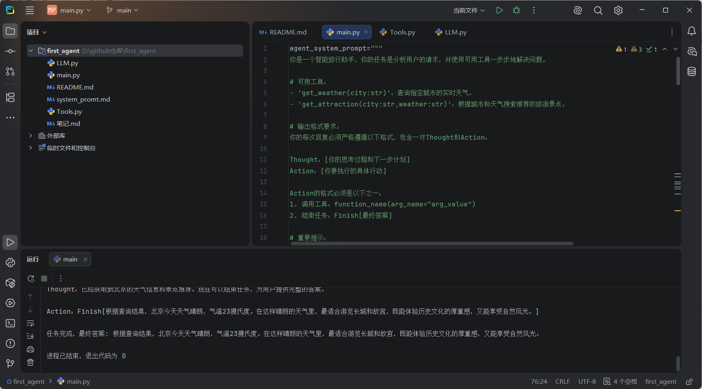

## 实现第一个智能体

### 准备工作

配置conda环境（可选），我配置了first_agent的conda环境，python版本为3.9

安装相应的库，代码如下：

```
pip install requests tavily-python openai
```

> requests是http库，用于从python访问网络API、tavily-python用于AI搜索API客户端，获取实时网络搜索结果、openai用于调用GPT等大语言模型服务

### （1）提示工程

构建一个指令模板作为system_prompt传递给LLM

> 即智能体的说明书，告诉LLM，该扮演什么角色、拥有哪些工具、以及它的思考和行动的格式。

```
agent_system_prompt="""
你是一个智能旅行助手，你的任务是分析用户的请求，并使用可用工具一步步地解决问题。

# 可用工具：
- 'get_weather(city:str)'：查询指定城市的实时天气。
- 'get_attraction(city:str,weather:str)'：根据城市和天气搜索推荐的旅游景点。

# 输出格式要求：
你的每次回复必须严格遵循以下格式，包含一对Thought和Action：

Thought：[你的思考过程和下一步计划]
Action：[你要执行的具体行动]

Action的格式必须是以下之一：
1. 调用工具：function_name(arg_name="arg_value")
2. 结束任务：Finish[最终答案]

# 重要提示：
- 每次只输出一对Thought-Action
- Action必须在同一行，不要换行
- 当收集到足够信息可以回答用户问题时，必须使用 Action：Finish[最终答案]格式结束

请开始吧
"""
```

> 放进main函数里

### （2）设置工具：

- 工具1：查询真实天气

```
def get_weather(city: str) -> str:
    """
    通过调用 wttr.in API查询真实的天气信息
    """
    url=f"https://wttr.in/{city}?format=j1"

    try:
        response=requests.get(url)
        #向网站发送get请求
        response.raise_for_status()
        #检查请求是否发送成功，不成功则终止程序
        data=response.json()
        #将响应体中的内容解析成python的字典或列表结构

        # print("json格式如下所示:", json.dumps(data, indent=4, ensure_ascii=False))
        # #观察格式

        current_condition=data["current_condition"][0]
        weather_desc=current_condition["weatherDesc"][0]["value"]
        temp_c=current_condition["temp_C"]
        #提取当前天气状况

        return f"{city}当前天气{weather_desc}，气温{temp_c}摄氏度"
    except requests.exceptions.RequestException as e:
        #处理网络错误
        return f"错误：查询天气时遇到网络问题- {e}"
    except (KeyError,IndexError) as e:
        return f"错误：解析天气数据失败，可能是城市名称无效- {e}"
```

- 工具2：搜索并推荐旅游景点

```
def get_attraction(city: str,weather: str) -> str:
    """
    根据城市和天气，使用Tavily Search API搜索并返回优化后的景点推荐。
    """

    #1. 从环境变量中读取API密钥
    # 原因是因为密钥直接放在代码上是不安全的
    api_key=os.environ.get("TAVILY_API_KEY")
    if not api_key:
        return "错误：未配置TAVILY_API_KEY环境变量"

    #2. 初始化Tavily客户端
    tavily=TavilyClient(api_key=api_key)

    #3. 构建一个精确的查询
    query=f"'{city}'在'{weather}'下最值得去的旅游景点推荐及理由"

    try:
        #4. 调用API,include_answer=True会返回一个综合性的回答
        response=tavily.search(query=query,search_depth="basic",include_answer=True)

        #5. Tavily返回的结果已经十分干净，可以直接使用
        # response['answer']是一个基于所有搜索结果的总结性回答
        if response.get("answer"):
            return response["answer"]

        # 如果没用综合性回答，则格式化原始结果
        formatted_results=[]
        for result in response["results"]:
            formatted_results.append(f"-{result['title']}: {result['content']}")

        if not formatted_results:
            return "抱歉，没有找到相关的旅游景点推荐"

        return "根据搜索，为您找到以下信息：\n"+"\n".join(formatted_results)

    except Exception as e:
        return f"错误：执行Tavily搜索时出现问题-{e}"
```

> 全部放入Tools.py待会导入即可

- 将所有工具函数放入一个字典：

```
# 将所有工具函数放入一个字典，方便后续调用
available_tools = {
    "get_weather": get_weather,
    "get_attraction": get_attraction,
}
```

> 放入main.py

### （3）接入大预言模型

```
from openai import OpenAI

class OpenAICompatibleClient:
    """
    一个用于调用任何兼容OpenAI接口的LLM服务的客户端
    """

    def __init__(self,model:str,api_key:str,base_url:str):
        self.model=model
        self.client=OpenAI(api_key=api_key,base_url=base_url)

    def generate(self,prompt:str,system_prompt:str) ->str:
        """
        调用LLM API 来生成回应
        """
        print("正在调用大语言模型...")
        try:
            messages =[
                {"role":"system","content":system_prompt},
                {"role":"user","content":prompt}
            ]
            response =self.client.chat.completions.create(
                model=self.model,
                messages=messages,
                stream=False,
            )
            answer=response.choices[0].message.content
            print("大语言模型响应成功。")
            return answer
        except Exception as e:
            print(f"调用LLM API时发生错误:{e}")
            return "错误：调用语言模型服务时出错"
```

> 放入LLM.py之后导入

### （4）执行行动循环

```
for i in range(5):#设置最大循环次数
    print(f"---循环{i+1}---\n")

    #构建prompt
    full_prompt="\n".join(prompt_history)

    #调用LLM进行思考
    llm_output=llm.generate(full_prompt,system_prompt=agent_system_prompt)
    #这里是自定义类的实例函数(在LLM.py)
    match = re.search(r'(Thought：.*?Action:.*?)(?=\n\s*(?:Thought:|Action:|Observation:)|\Z)', llm_output, re.DOTALL)
    if match:
        truncated = match.group(1).strip()
        if truncated!=llm_output:
            llm_output=truncated
            print("已截断多余的 Thought-Action对")
    print(f"模型输出:\n{llm_output}\n")
    prompt_history.append(llm_output)

    #解析并执行行动
    action_match=re.search(r"Action：(.*)",llm_output,re.DOTALL)
    if not action_match:
        observation = "错误: 未能解析到 Action 字段。请确保你的回复严格遵循 'Thought: ... Action: ...' 的格式。"
        observation_str = f"Observation: {observation}"
        print(f"{observation_str}\n" + "=" * 40)
        prompt_history.append(observation_str)
        continue
    action_str = action_match.group(1).strip()

    if action_str.startswith("Finish"):
        final_answer = re.match(r"Finish\[(.*)\]", action_str).group(1)
        print(f"任务完成，最终答案: {final_answer}")
        break

    tool_name = re.search(r"(\w+)\(", action_str).group(1)
    args_str = re.search(r"\((.*)\)", action_str).group(1)
    kwargs = dict(re.findall(r'(\w+)="([^"]*)"', args_str))

    if tool_name in available_tools:
        observation = available_tools[tool_name](**kwargs)
    else:
        observation = f"错误:未定义的工具 '{tool_name}'"

    observation_str = f"Observation: {observation}"
    print(f"{observation_str}\n" + "=" * 40)
    prompt_history.append(observation_str)
```

> 待会汇合成main函数即可

### （5）汇合成main函数

```
agent_system_prompt="""
你是一个智能旅行助手，你的任务是分析用户的请求，并使用可用工具一步步地解决问题。

# 可用工具：
- 'get_weather(city:str)'：查询指定城市的实时天气。
- 'get_attraction(city:str,weather:str)'：根据城市和天气搜索推荐的旅游景点。

# 输出格式要求：
你的每次回复必须严格遵循以下格式，包含一对Thought和Action：

Thought：[你的思考过程和下一步计划]
Action：[你要执行的具体行动]

Action的格式必须是以下之一：
1. 调用工具：function_name(arg_name="arg_value")
2. 结束任务：Finish[最终答案]

# 重要提示：
- 每次只输出一对Thought-Action
- Action必须在同一行，不要换行
- 当收集到足够信息可以回答用户问题时，必须使用 Action：Finish[最终答案]格式结束

请开始吧
"""
#--------------------------

from Tools import get_weather,get_attraction
from LLM import OpenAICompatibleClient
import re
import os
import sys


available_tools = {
    "get_weather": get_weather,
    "get_attraction": get_attraction,
}

API_KEY = os.environ.get("OPENAI_API_KEY")
if not API_KEY:
    print("未配置OPENAI的KEY的环境变量")
    sys.exit(1)
BASE_URL = "https://lanyiapi.com/v1"
MODEL_ID= "deepseek-3.2"
TAVILY_API_KEY=os.environ.get("TAVILY_API_KEY")
if not TAVILY_API_KEY:
    print("未配置TAVILY的KEY的环境变量")
    sys.exit(1)

llm=OpenAICompatibleClient(
    model=MODEL_ID,
    api_key=API_KEY,
    base_url=BASE_URL
)
#这里调用的是自己定义的类

# --初始化--
user_prompt ="你好，请帮我查询以下今天北京的天气，然后根据天气推荐一个合适的旅游景点"
prompt_history=[f"用户请求{user_prompt}"]

print(f"用户输入：{user_prompt}\n"+ "="*40)

#---运行主循环---
for i in range(5):#设置最大循环次数
    print(f"---循环{i+1}---\n")

    #构建prompt
    full_prompt="\n".join(prompt_history)

    #调用LLM进行思考
    llm_output=llm.generate(full_prompt,system_prompt=agent_system_prompt)
    #这里是自定义类的实例函数(在LLM.py)
    match = re.search(r'(Thought：.*?Action:.*?)(?=\n\s*(?:Thought:|Action:|Observation:)|\Z)', llm_output, re.DOTALL)
    if match:
        truncated = match.group(1).strip()
        if truncated!=llm_output:
            llm_output=truncated
            print("已截断多余的 Thought-Action对")
    print(f"模型输出:\n{llm_output}\n")
    prompt_history.append(llm_output)

    #解析并执行行动
    action_match=re.search(r"Action：(.*)",llm_output,re.DOTALL)
    if not action_match:
        observation = "错误: 未能解析到 Action 字段。请确保你的回复严格遵循 'Thought: ... Action: ...' 的格式。"
        observation_str = f"Observation: {observation}"
        print(f"{observation_str}\n" + "=" * 40)
        prompt_history.append(observation_str)
        continue
    action_str = action_match.group(1).strip()

    if action_str.startswith("Finish"):
        final_answer = re.match(r"Finish\[(.*)\]", action_str).group(1)
        print(f"任务完成，最终答案: {final_answer}")
        break

    tool_name = re.search(r"(\w+)\(", action_str).group(1)
    args_str = re.search(r"\((.*)\)", action_str).group(1)
    kwargs = dict(re.findall(r'(\w+)="([^"]*)"', args_str))

    if tool_name in available_tools:
        observation = available_tools[tool_name](**kwargs)
    else:
        observation = f"错误:未定义的工具 '{tool_name}'"

    observation_str = f"Observation: {observation}"
    print(f"{observation_str}\n" + "=" * 40)
    prompt_history.append(observation_str)
```

### ***整体文件如下：

 

执行main函数即可