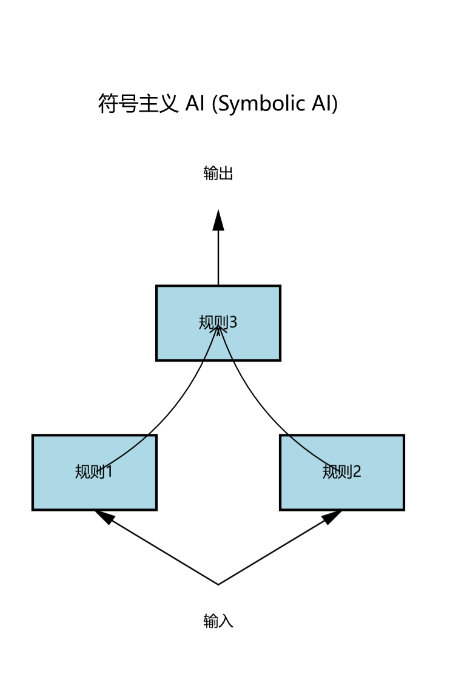
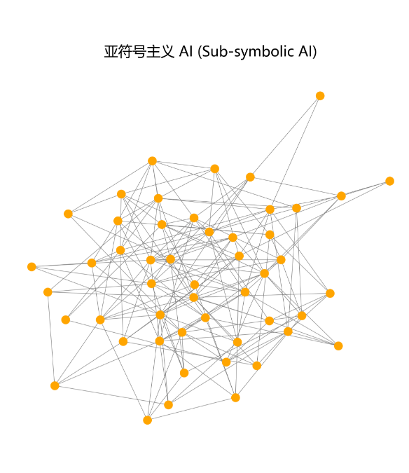
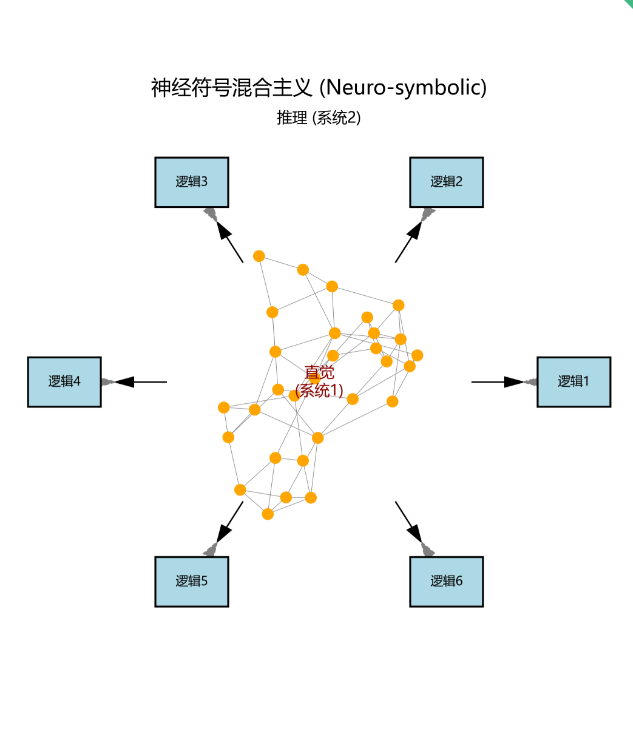
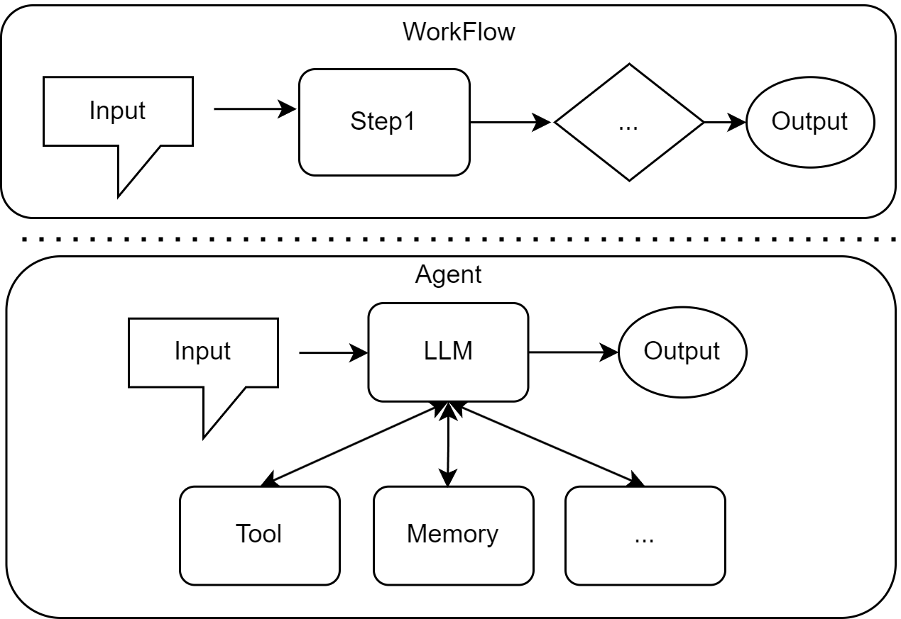
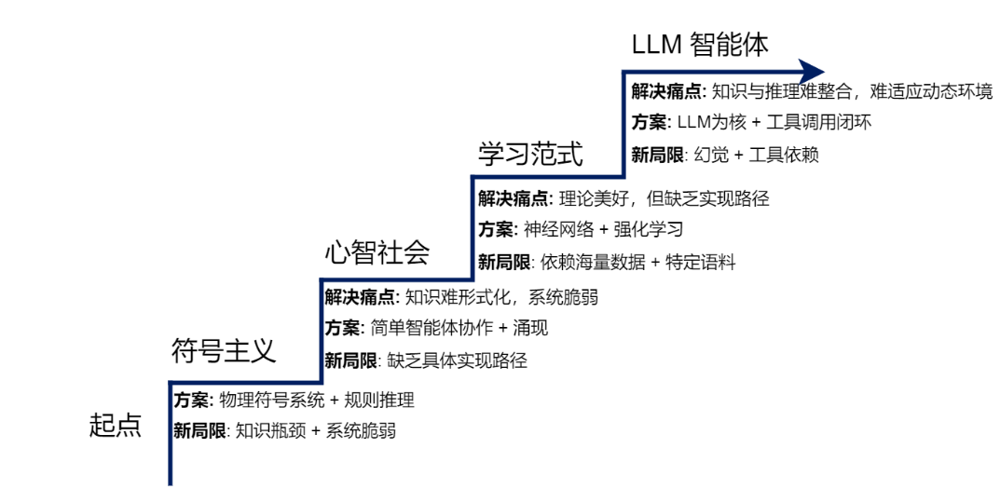
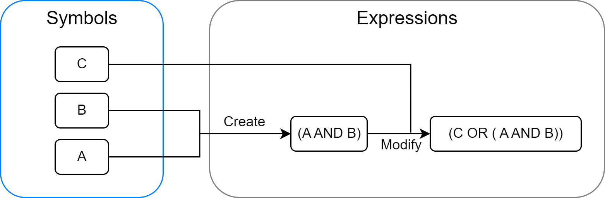
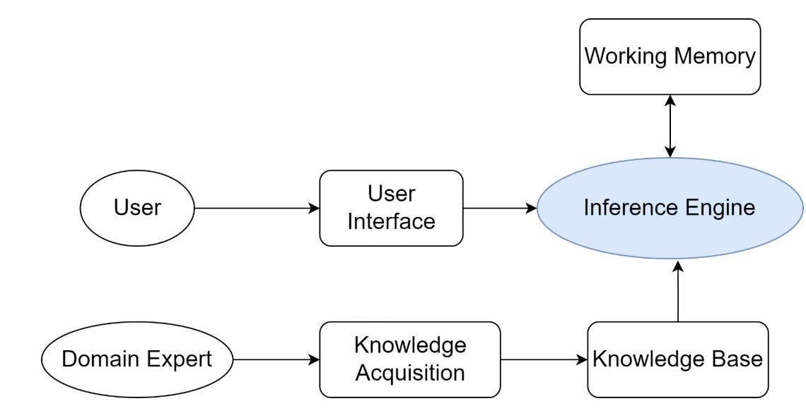
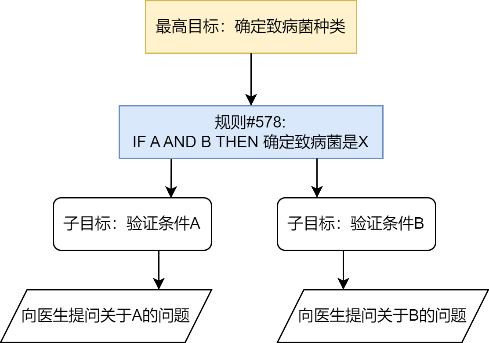
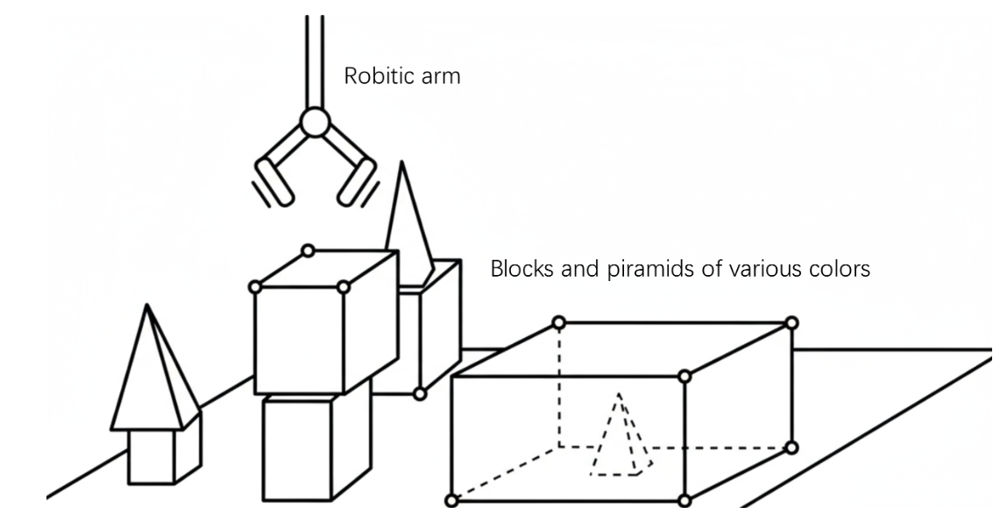

# 一、初识智能体

## 1、什么是智能体

（1）核心定义：通过传感器感知周围环境，借助执行器采取行动，以达成特定目标的实体

（2）四大基本要素：

- 环境：信息源
- 传感器：智能体获取环境的部件
- 执行器：智能体用于改变环境的部件
- 自主性：智能的体现，可基于环境和内部状态独立决策（区别于被动响应）

### 1.1 智能体的演进

（1）反射智能体：完全依赖瞬时感知输入，无记忆与预测能力

> 温度>25就开空调

（2）基于模型的反射智能体：可预判追踪环境中无法感知的信息，拥有初级记忆能力

> 隧道中行驶的自动驾驶汽车

（3）基于目标的智能体：以目标为核心导向，能主动、有预见性地规划可达成目标的行动

> 需要回答”我该做什么才能达成目标“的智能体，如GPS导航系统

（4）基于效用的智能体：在基于目标的智能体上最大化期望效用

> 回答”那种行为能让我带来满意的结果“

（5）**学习型智能体**：和前几类都不一样，决策逻辑、规则、模型都是依赖于人类设计师的先验知识。学习型智能体是设法不依赖先验知识，而是通过与环境的自主学习去实现目标。

> 如alphago在大量训练中通过强化学习发现了许多超越人类既有知识的有效策略

### 1.2 大语言模型带来的改变

大语言模型使智能体的构建从”工程师显式编程“到“模型自主规划与决策”，并且大语言模型可处理模糊、高层的自然语言指令。现在的趋势慢慢从开发专用自动化工具转向构建能自主解决问题的系统

> 在大语言模型之前需要人自主决策，出现之后模型可以自动完成一系列动作，如模型将目标拆成子目标序列，调用工具补全信息，动态修正自身行为与方案

### 1.3 智能体的类型

（1）基于内部决策架构分类

区分点在于决策机制的复杂程度，即刚刚说的：反射智能体、基于模型的反射智能体、基于目标的智能体、基于效用的智能体、再到学习型智能体

（2）基于时间与反应性分类

是否经过深思熟虑的规划再行动还是收到信息后立马行动。反应了速度和追求最优解直之间的权衡

- 反应式智能体：决策时间少速度快，不进行或进行极少的未来规划

> 如安全气囊必须在毫秒内作出反应，但是这种速度带来的代价是“短视”，容易陷入局部最优

- 规划式智能体：决策时间长，会进行复杂的思考和规划

> 如alphago不会只盯着眼前的棋局，会想以后的棋局，但是耗时长，在瞬息万变的环境可能错过时机

- 混合式智能体：结合了两者的优点，实现了反应与时间的平衡

> 通过规划-反应的微循环使其既能灵活应对环境的即时变化，又能进行长远的规划

 

（3）基于知识表分类

- 符号类ai：智能源于对符号的逻辑操作。操作遵循严格的逻辑规则

 

- 亚符号类ai：智能源于海量数据，内隐分布在一个由大量神经元组成的复杂网络中

 

- 神经符号混合主义ai：两者的混合，既能像神经网络一样从数据中学习，又能像符号系统一样进行逻辑推理的混合智能体

 

## 2、智能体的构成与运行原理

### 2.1 任务环境定义

使用PEAS模型（包括四个维度）来描述一个任务环境，包括：

| 维度                  | 描述                     |
| --------------------- | ------------------------ |
| 环境(envionment)      | 信息源                   |
| 传感器(sensors)       | 智能体获取环境的部件     |
| 执行器(actuators)     | 智能体用于改变环境的部件 |
| 性能度量(performance) | 如何评估成功             |

其中影响智能体设计的环境的四大复杂特性为：

（1）部分可观察：无法一次性获取全部信息

> 旅行助手无法一次获取所有航空公司的实时信息，只能通过调用航班预定API一个个查，需要智能体具备记忆和探索的能力

（2）随机性：相同行动可能产生不同结果

> 例如搜票价每次可能产生不同结果

（3）多智能体：环境中存在其它行动者

> 如航天公司的动态调价系统，其它用户订票

（4）序贯且动态：序贯代表当前动作会影响未来，动态则意味环境自身可能在决策时发生变化

> 所以要求智能体必须快速、灵活的适应持续变化的世界

### 2.2 智能体的运行机制

智能体的核心运作机制为智能体循环，构成了其自主行动的基础，如下表示：

 

（1）感知（perception）：用于接收环境输入

> 如用户指令、API返回结果、状态变化反馈

（2）思考（Thought）：由大语言模型驱动，包括

① 规划（Planning）：分解任务、调整任务

②工具选择（Tool Selection）：选哪个工具、填什么参数

（3）行动（Action）：调用工具（如代码解释器、搜索引擎API）执行具体动作

即传感器获取环境，执行器改变环境，传感器获取新环境，不断形成“感知-思考-行动-感知”的闭环

### 2.3 智能体的感知与行动

为了有效驱动这个循环，我们需要明确一套交互协议来规范智能体与环境之间的信息交换，在许多智能体框架中，这一协议体现在输出的结构化定义上。智能体输出不再是单一的自然语言回复，而是一段遵循特定格式的文本，包含两个核心部分：

- Thought（思考）：以自然语言阐述了当前内部决策“快照”，通过分析情景、规划下一步

> 如Thought: 用户想知道北京的天气。我需要调用天气查询工具。

- Action（行动）：决定对外执行的具体操作，以函数调用的形式表示

> 如Action: get_weather("北京")

行动执行后，环境返回的原始数据可能是包含详细天气数据的JSON对象。通常包含LLM无需关注的冗余信息，格式也不符合自然语言处理的习惯。因此传感器需要将这个原始数据封装成一段简单清晰的自然语言，供LLM理解

> ```
> 例如{"temp":25, "condition":"晴"}` → `Observation: 北京当前天气为晴，气温25摄氏度，微风。
> ```

这段Observation文本会反馈给智能体，作为下一轮循环的输入信息。从而完成由Thought、Action、Observation构成的严谨循环

## 3、实现第一个智能体

### 3.1 准备工作

配置conda环境（可选），我配置了first_agent的conda环境，python版本为3.9

安装相应的库，代码如下：

```
pip install requests tavily-python openai
```

> requests是http库，用于从python访问网络API、tavily-python用于AI搜索API客户端，获取实时网络搜索结果、openai用于调用GPT等大语言模型服务

#### （1）提示工程

构建一个指令模板作为system_prompt传递给LLM

> 即智能体的说明书，告诉LLM，该扮演什么角色、拥有哪些工具、以及它的思考和行动的格式。

```
agent_system_prompt="""
你是一个智能旅行助手，你的任务是分析用户的请求，并使用可用工具一步步地解决问题。

# 可用工具：
- 'get_weather(city:str)'：查询指定城市的实时天气。
- 'get_attraction(city:str,weather:str)'：根据城市和天气搜索推荐的旅游景点。

# 输出格式要求：
你的每次回复必须严格遵循以下格式，包含一对Thought和Action：

Thought：[你的思考过程和下一步计划]
Action：[你要执行的具体行动]

Action的格式必须是以下之一：
1. 调用工具：function_name(arg_name="arg_value")
2. 结束任务：Finish[最终答案]

# 重要提示：
- 每次只输出一对Thought-Action
- Action必须在同一行，不要换行
- 当收集到足够信息可以回答用户问题时，必须使用 Action：Finish[最终答案]格式结束

请开始吧
"""
```

> 放进main函数里

#### （2）设置工具：

- 工具1：查询真实天气

```
def get_weather(city: str) -> str:
    """
    通过调用 wttr.in API查询真实的天气信息
    """
    url=f"https://wttr.in/{city}?format=j1"

    try:
        response=requests.get(url)
        #向网站发送get请求
        response.raise_for_status()
        #检查请求是否发送成功，不成功则终止程序
        data=response.json()
        #将响应体中的内容解析成python的字典或列表结构

        # print("json格式如下所示:", json.dumps(data, indent=4, ensure_ascii=False))
        # #观察格式

        current_condition=data["current_condition"][0]
        weather_desc=current_condition["weatherDesc"][0]["value"]
        temp_c=current_condition["temp_C"]
        #提取当前天气状况

        return f"{city}当前天气{weather_desc}，气温{temp_c}摄氏度"
    except requests.exceptions.RequestException as e:
        #处理网络错误
        return f"错误：查询天气时遇到网络问题- {e}"
    except (KeyError,IndexError) as e:
        return f"错误：解析天气数据失败，可能是城市名称无效- {e}"
```

- 工具2：搜索并推荐旅游景点

```
def get_attraction(city: str,weather: str) -> str:
    """
    根据城市和天气，使用Tavily Search API搜索并返回优化后的景点推荐。
    """

    #1. 从环境变量中读取API密钥
    # 原因是因为密钥直接放在代码上是不安全的
    api_key=os.environ.get("TAVILY_API_KEY")
    if not api_key:
        return "错误：未配置TAVILY_API_KEY环境变量"

    #2. 初始化Tavily客户端
    tavily=TavilyClient(api_key=api_key)

    #3. 构建一个精确的查询
    query=f"'{city}'在'{weather}'下最值得去的旅游景点推荐及理由"

    try:
        #4. 调用API,include_answer=True会返回一个综合性的回答
        response=tavily.search(query=query,search_depth="basic",include_answer=True)

        #5. Tavily返回的结果已经十分干净，可以直接使用
        # response['answer']是一个基于所有搜索结果的总结性回答
        if response.get("answer"):
            return response["answer"]

        # 如果没用综合性回答，则格式化原始结果
        formatted_results=[]
        for result in response["results"]:
            formatted_results.append(f"-{result['title']}: {result['content']}")

        if not formatted_results:
            return "抱歉，没有找到相关的旅游景点推荐"

        return "根据搜索，为您找到以下信息：\n"+"\n".join(formatted_results)

    except Exception as e:
        return f"错误：执行Tavily搜索时出现问题-{e}"
```

> 全部放入Tools.py待会导入即可

- 将所有工具函数放入一个字典：

```
# 将所有工具函数放入一个字典，方便后续调用
available_tools = {
    "get_weather": get_weather,
    "get_attraction": get_attraction,
}
```

> 放入main.py

#### （3）接入大预言模型

```
from openai import OpenAI

class OpenAICompatibleClient:
    """
    一个用于调用任何兼容OpenAI接口的LLM服务的客户端
    """

    def __init__(self,model:str,api_key:str,base_url:str):
        self.model=model
        self.client=OpenAI(api_key=api_key,base_url=base_url)

    def generate(self,prompt:str,system_prompt:str) ->str:
        """
        调用LLM API 来生成回应
        """
        print("正在调用大语言模型...")
        try:
            messages =[
                {"role":"system","content":system_prompt},
                {"role":"user","content":prompt}
            ]
            response =self.client.chat.completions.create(
                model=self.model,
                messages=messages,
                stream=False,
            )
            answer=response.choices[0].message.content
            print("大语言模型响应成功。")
            return answer
        except Exception as e:
            print(f"调用LLM API时发生错误:{e}")
            return "错误：调用语言模型服务时出错"
```

> 放入LLM.py之后导入

#### （4）执行行动循环

```
for i in range(5):#设置最大循环次数
    print(f"---循环{i+1}---\n")

    #构建prompt
    full_prompt="\n".join(prompt_history)

    #调用LLM进行思考
    llm_output=llm.generate(full_prompt,system_prompt=agent_system_prompt)
    #这里是自定义类的实例函数(在LLM.py)
    match = re.search(r'(Thought：.*?Action:.*?)(?=\n\s*(?:Thought:|Action:|Observation:)|\Z)', llm_output, re.DOTALL)
    if match:
        truncated = match.group(1).strip()
        if truncated!=llm_output:
            llm_output=truncated
            print("已截断多余的 Thought-Action对")
    print(f"模型输出:\n{llm_output}\n")
    prompt_history.append(llm_output)

    #解析并执行行动
    action_match=re.search(r"Action：(.*)",llm_output,re.DOTALL)
    if not action_match:
        observation = "错误: 未能解析到 Action 字段。请确保你的回复严格遵循 'Thought: ... Action: ...' 的格式。"
        observation_str = f"Observation: {observation}"
        print(f"{observation_str}\n" + "=" * 40)
        prompt_history.append(observation_str)
        continue
    action_str = action_match.group(1).strip()

    if action_str.startswith("Finish"):
        final_answer = re.match(r"Finish\[(.*)\]", action_str).group(1)
        print(f"任务完成，最终答案: {final_answer}")
        break

    tool_name = re.search(r"(\w+)\(", action_str).group(1)
    args_str = re.search(r"\((.*)\)", action_str).group(1)
    kwargs = dict(re.findall(r'(\w+)="([^"]*)"', args_str))

    if tool_name in available_tools:
        observation = available_tools[tool_name](**kwargs)
    else:
        observation = f"错误:未定义的工具 '{tool_name}'"

    observation_str = f"Observation: {observation}"
    print(f"{observation_str}\n" + "=" * 40)
    prompt_history.append(observation_str)
```

> 待会汇合成main函数即可

#### （5）汇合成main函数

```
agent_system_prompt="""
你是一个智能旅行助手，你的任务是分析用户的请求，并使用可用工具一步步地解决问题。

# 可用工具：
- 'get_weather(city:str)'：查询指定城市的实时天气。
- 'get_attraction(city:str,weather:str)'：根据城市和天气搜索推荐的旅游景点。

# 输出格式要求：
你的每次回复必须严格遵循以下格式，包含一对Thought和Action：

Thought：[你的思考过程和下一步计划]
Action：[你要执行的具体行动]

Action的格式必须是以下之一：
1. 调用工具：function_name(arg_name="arg_value")
2. 结束任务：Finish[最终答案]

# 重要提示：
- 每次只输出一对Thought-Action
- Action必须在同一行，不要换行
- 当收集到足够信息可以回答用户问题时，必须使用 Action：Finish[最终答案]格式结束

请开始吧
"""
#--------------------------

from Tools import get_weather,get_attraction
from LLM import OpenAICompatibleClient
import re
import os
import sys


available_tools = {
    "get_weather": get_weather,
    "get_attraction": get_attraction,
}

API_KEY = os.environ.get("OPENAI_API_KEY")
if not API_KEY:
    print("未配置OPENAI的KEY的环境变量")
    sys.exit(1)
BASE_URL = "https://lanyiapi.com/v1"
MODEL_ID= "deepseek-3.2"
TAVILY_API_KEY=os.environ.get("TAVILY_API_KEY")
if not TAVILY_API_KEY:
    print("未配置TAVILY的KEY的环境变量")
    sys.exit(1)

llm=OpenAICompatibleClient(
    model=MODEL_ID,
    api_key=API_KEY,
    base_url=BASE_URL
)
#这里调用的是自己定义的类

# --初始化--
user_prompt ="你好，请帮我查询以下今天北京的天气，然后根据天气推荐一个合适的旅游景点"
prompt_history=[f"用户请求{user_prompt}"]

print(f"用户输入：{user_prompt}\n"+ "="*40)

#---运行主循环---
for i in range(5):#设置最大循环次数
    print(f"---循环{i+1}---\n")

    #构建prompt
    full_prompt="\n".join(prompt_history)

    #调用LLM进行思考
    llm_output=llm.generate(full_prompt,system_prompt=agent_system_prompt)
    #这里是自定义类的实例函数(在LLM.py)
    match = re.search(r'(Thought：.*?Action:.*?)(?=\n\s*(?:Thought:|Action:|Observation:)|\Z)', llm_output, re.DOTALL)
    if match:
        truncated = match.group(1).strip()
        if truncated!=llm_output:
            llm_output=truncated
            print("已截断多余的 Thought-Action对")
    print(f"模型输出:\n{llm_output}\n")
    prompt_history.append(llm_output)

    #解析并执行行动
    action_match=re.search(r"Action：(.*)",llm_output,re.DOTALL)
    if not action_match:
        observation = "错误: 未能解析到 Action 字段。请确保你的回复严格遵循 'Thought: ... Action: ...' 的格式。"
        observation_str = f"Observation: {observation}"
        print(f"{observation_str}\n" + "=" * 40)
        prompt_history.append(observation_str)
        continue
    action_str = action_match.group(1).strip()

    if action_str.startswith("Finish"):
        final_answer = re.match(r"Finish\[(.*)\]", action_str).group(1)
        print(f"任务完成，最终答案: {final_answer}")
        break

    tool_name = re.search(r"(\w+)\(", action_str).group(1)
    args_str = re.search(r"\((.*)\)", action_str).group(1)
    kwargs = dict(re.findall(r'(\w+)="([^"]*)"', args_str))

    if tool_name in available_tools:
        observation = available_tools[tool_name](**kwargs)
    else:
        observation = f"错误:未定义的工具 '{tool_name}'"

    observation_str = f"Observation: {observation}"
    print(f"{observation_str}\n" + "=" * 40)
    prompt_history.append(observation_str)
```

#### ***整体文件如下：

 

执行main函数即可

## 4、智能体应用的协作模式

智能体如今在应用的协作模式分两种，一种是作为高效工具，深度融入人类工作流，辅助人完成任务。另一种是作为自主协作者，多个智能体之间相互协作，共同完成复杂目标

### 4.1 作为开发者工具的智能体

| 工具           | 形态                   | 核心特点                                                     |
| -------------- | ---------------------- | ------------------------------------------------------------ |
| GitHub Copilot | VS Code等编辑器插件    | 实时代码补全（整行/函数块）+ 对话式编程                      |
| Claude Code    | 终端命令行工具         | 理解代码库结构，支持编辑、测试、调试；有无交互模式，适合自动化 |
| Trae           | 智能编程辅助           | 轻量级、快速响应，侧重代码生成、优化、自动化重构             |
| Cursor         | AI原生编辑器（非插件） | 以AI交互为核心，理解整个代码库上下文，支持深层问答、重构、调试 |

> 简单来说就是介绍了几款作为开发者工具的智能体，用来说明现今趋势是AI正深度融入软件开发全生命周期，构建人机协同工作流。

### 4.2 作为自主协作者的智能体

第二种交互模式（自主协作者）将智能体的自动化程度提升到了一个全新的层次。从“命令-执行”到“目标-委托”，智能体成为主动的目标追求者。其中大多优秀框架（如CrewAI、AutoGEN等）的架构可以大致归纳为如下几个方向：

#### （1）单智能体自主循环

通过“思考-规划-执行-反思”闭环，自我迭代完成高层次目标，如AgentGPT

#### （2）多智能体协作

当今最主流的探索方向，旨在通过模拟人类团队的协作模式来解决复杂问题。它又可细分为不同模式：

① 角色扮演式对话：通过设定明确的角色和沟通协议，让它们在一个结构化的对话中协同完成任务

> 如CAMEL框架

② 组织化工作流：模拟一个分工明确的“虚拟团队”。每个智能体都有预设的职责和工作流程，通过层级化或顺序化的方式协作，产生高质量的复杂成果（如完整的代码库或研究报告）

> 如MetaGPT和CrewAI

③  高级控制流架构：将执行过程建模为状态图，从而更灵活、更可靠的地实现循环、分支、回溯及人工介入等复杂流程

> 如LangGraph

#### （3）Workflow和Agent的差异

Workflow是让AI按部就班地执行命令，而Agent则是赋予AI自由度去自主达成目标

 

# 二、智能体发展

本章回溯智能体发展史，理解现代智能体形态和设计思想的由来，从最早古典时代中在符号与逻辑规则体系中定义最早的“智能”→从单一集中式智能模型→分布式、协作式智能，范式如何彻底改变智能体获取能力的方式，催生现代智能体。每一个范式的出现都是为了解决上一个范式的核心痛点或根本局限，但又引来了新的疼点与局限。这一过程就是“问题”驱动的迭代历程。能帮助我们更深刻地把握现代智能体技术选型的深层原因和历史必然性，如下图所示：

 

## 1、基于符号与逻辑的早期智能体

早期因受数理逻辑和计算机科学基本原理的影响。研究者认为人类的智能，尤其是逻辑推理能力可以被形式化的符号体系所捕捉或复现。这一核心思想催生了人工智能的第一个重要范式--符号主义，也被称为“逻辑ai”或“传统ai”。在符号主义看来，智能行为的核心是基于一套明确规划对符号进行操作。这个时候的智能体被视作一个物理符号系统，通过内部的符号来表示外界世界，并通过逻辑推理来规划行动。这个时候智能体的智慧完全来源于设计者预先编码的知识库和推理规则，而非通过自主学习获得。

### 1.1 物理符号系统假说

- 核心论断：

充分性：任何一个物理符号系统，都具备产生通用智能行为的充分手段。

必要性：任何能展现通用智能行为的系统，其本质必然是一个物理符号系统

物理系统指存在于物理世界，由可区分的符号和对符号进行操作的过程组成。过程可创建、修改、复制、销毁符号结构。如下图所示：

 

> 总而言之，物理符号系统假说就是认为智能的本质，就是符号的计算与处理

物理符号系统假说首次将心智哲学问题转化为计算机工程问题，给早期ai注入了信心：只要找到正确方法和推理算法，就能创造机器智能。从专家系统到自动规划，几乎整个符号主义时代的研究都是在该假说的指引下展开的。

### 1.2 专家系统

在物理符号系统假说的直接影响下，专家系统成为符号主义最重要、最成功的应用成果。目的是为了模拟人类专家在特定领域的解决问题的能力，一个典型的专家系统通常由知识库、推理机、用户界面等几个核心部分组成，其通用架构如图所示：

 

- 专家系统两大核心组件：

知识库：存放领域专家知识，常用的表示方式为产生式规则

> 产生式规则即一系列“IF-THEN”形式的条件语句，如IF 病人有发烧症状 AND 咳嗽 THEN 可能患有呼吸道感染。这些规则将特定情景（IF部分，条件）与相应的结论或行动（THEN部分，结论）关联起来。一个复杂的专家系统可能包含成百上千条这样的规则

推理机：核心计算引擎，负责在知识库寻找并应用规则，并推导出新结论。有两种工作方式：

① 正向链：从已知事实出发，不断匹配规则，触发THEN部分的结论，并将新规则加入事实库，直到推导出目标或无新规则可匹配

② 反向链：从假设目标出发，反向寻找能推导该目标的规则，递归验证子规则

- 应用案例：MYCIN系统

> 用于辅助医生诊断细菌性血液感染并推荐合适的抗生素治疗方案

工作原理：主要采用反向链的方式工作，从“确定致病菌”这一最高目标出发，反向推导需要哪些证据和条件，然后向医生提问以获取这些信息。其简化的工作流程如图所示：

 

> 创新：引入置信因子，用于处理不确定性

### 1.3 SHRDLU

SHRDLU旨在构建在“积木世界”这一微观环境，通过自然语言与人类交互的智能体，内含积木和虚拟机械臂。用户通过自然语言向SHRDLU下达指令或提问，SHRDLU则在虚拟世界中执行行动或给出文字回答。

 

 


它首次将语言解析、规划、记忆集成在一个统一系统中，使它们协同工作，三大集成模块如下：

① 自然语言解析：SHRDLU能够解析结构复杂且含有歧义的英语句子

> 如 Pick up a big red block,和指代消解等更复杂的指令:Find a block which is taller than the one you are holding and put it into the box. 在这条指令中，系统需要理解 the one you are holding 指代的是当前机械臂正抓取的物体。

② 规划和行动：自主规划动作序列

> 如:  如果指令是“把蓝色积木放到红色积木上”，而红色积木上已经有另一个绿色积木，系统会规划出“先把绿色积木移开，再把蓝色积木放上去”的动作序列。

③ 记忆与问答: SHRDLU拥有关于其所处环境和自身行为的记忆

> 如: 可以向其询问世界状态：Is there a large block behind a pyramid?

SHRDLU证明了在一个规则明确的简化环境中,探索和验证复杂智能体基本原理的可行性

### 1.4 符号主义面临的根本性挑战

#### （1） 常识知识与知识获取瓶颈

- 知识获取瓶颈：知识库依赖人类专家和知识工程师通过繁琐的访谈、提炼和编码过程来构建。成本高昂、耗时长难以规模化。且许多知识都是内隐性的、直觉性的，很难被清晰地表达为“IF-THEN”规则
- 常识问题：人类行为依赖于庞大的常识背景（如水是湿的、绳子可以拉不能推），但符号系统除非被明确编码，否则对此一无所知。为广阔、模糊的常识建立完备的知识库至今仍是重大挑战

#### （2）框架问题与系统脆弱性

- 框架问题：动态世界中，执行一个动作后，如何高效判断哪些事物未改变是逻辑难题；为每个动作显示声明所有不变状态在计算机上不可行
- 系统脆弱性：完全依赖预设规则，一旦遇到规则之外的微小变化或新情况，系统便可能完全失灵，无法像人类一样灵活

## 2、构建基于规则的聊天机器人

通过一个具体的编程实践，来直观地感受基于规则的系统是如何工作的。将尝试复现人工智能历史上一个极具影响力的早期聊天机器人-ELIZA。

### 2.1 ELIZA的设计思想

通过一套预设的转化规则，将用户的陈述转化为一个开放式的提问。例如，当用户说“我为我的男朋友感到难过”时，ELIZA可能会识别出关键词“我为……感到难过”，并应用规则生成回应：“你为什么会为你的男朋友感到难过？”ELIZA作者想证明，通过一些简单的句式转换技巧，机器可以在完全不理解对话内容的情况下，营造出一种“智能”和共情的假象。

### 2.2 模式匹配与文本替换

算法流程可以分为以下四个步骤

#### （1）关键词识别与排序

在规则库中为每个关键词预设优先级，输入包含多个关键词时，选择优先级最高的规则处理

> 示例关键词：mother, dreamed, depressed

#### （2）分解规则

找到关键词后，程序用带通配符*的分解规则，捕获句子的其余部分

> 规则示例：* my *
> 输入："My mother is afraid of me"
> 捕获：["", "mother is afraid of me"]

#### （3）重组规则

从关联的重组规则中（可随机）选择一条生成回应，可选择性使用捕获的内容

> 规则示例： "Tell me more about your family."
>
> 生成输出： "Tell me more about your family."

#### （4）代词转换

在重组前进行代词转换（I → you，my→your），维持对话连贯性

> 示例："I feel sad" → "Why do you feel sad?"

整个流程用伪代码的思路如下所示：

```
FUNCTION generate_response(user_input):
    // 1. 将用户输入拆分成单词
    words = SPLIT(user_input)

    // 2. 寻找优先级最高的关键词规则
    best_rule = FIND_BEST_RULE(words)
    IF best_rule is NULL:
        RETURN a_generic_response() //	 例如:"Please go on."

    // 3. 使用规则分解用户输入
    decomposed_parts = DECOMPOSE(user_input, best_rule.decomposition_pattern)
    IF decomposition_failed:
        RETURN a_generic_response()

    // 4. 对分解出的部分进行代词转换
    transformed_parts = TRANSFORM_PRONOUNS(decomposed_parts)

    // 5. 使用重组规则生成回应
    response = REASSEMBLE(transformed_parts, best_rule.reassembly_patterns)

    RETURN response
```

### 2.3 python实现简单的ELIZA

```
import re
import random

# 定义规则库:模式(正则表达式) -> 响应模板列表
rules = {
    r'I need (.*)': [
        "Why do you need {0}?",
        "Would it really help you to get {0}?",
        "Are you sure you need {0}?"
    ],
    r'Why don\'t you (.*)\?': [
        "Do you really think I don't {0}?",
        "Perhaps eventually I will {0}.",
        "Do you really want me to {0}?"
    ],
    r'Why can\'t I (.*)\?': [
        "Do you think you should be able to {0}?",
        "If you could {0}, what would you do?",
        "I don't know -- why can't you {0}?"
    ],
    r'I am (.*)': [
        "Did you come to me because you are {0}?",
        "How long have you been {0}?",
        "How do you feel about being {0}?"
    ],
    r'.* mother .*': [
        "Tell me more about your mother.",
        "What was your relationship with your mother like?",
        "How do you feel about your mother?"
    ],
    r'.* father .*': [
        "Tell me more about your father.",
        "How did your father make you feel?",
        "What has your father taught you?"
    ],
    r'.*': [
        "Please tell me more.",
        "Let's change focus a bit... Tell me about your family.",
        "Can you elaborate on that?"
    ]
}

# 定义代词转换规则
pronoun_swap = {
    "i": "you", "you": "i", "me": "you", "my": "your",
    "am": "are", "are": "am", "was": "were", "i'd": "you would",
    "i've": "you have", "i'll": "you will", "yours": "mine",
    "mine": "yours"
}


def swap_pronouns(phrase):
    """
    对输入短语中的代词进行第一/第二人称转换
    """
    words = phrase.lower().split()
    swapped_words = [pronoun_swap.get(word, word) for word in words]
    return " ".join(swapped_words)


def respond(user_input):
    """
    根据规则库生成响应
    """
    for pattern, responses in rules.items():
        match = re.search(pattern, user_input, re.IGNORECASE)
        if match:
            # 捕获匹配到的部分
            captured_group = match.group(1) if match.groups() else ''
            # 进行代词转换
            swapped_group = swap_pronouns(captured_group)
            # 从模板中随机选择一个并格式化
            response = random.choice(responses).format(swapped_group)
            return response
    # 如果没有匹配任何特定规则，使用最后的通配符规则
    return random.choice(rules[r'.*'])


# 主聊天循环
if __name__ == '__main__':
    print("Therapist: Hello! How can I help you today?")
    while True:
        user_input = input("You: ")
        if user_input.lower() in ["quit", "exit", "bye"]:
            print("Therapist: Goodbye. It was nice talking to you.")
            break
        response = respond(user_input)
        print(f"Therapist: {response}")
```

局限性有缺乏语义理解，不理解语义，会机械的匹配规则生成不通的回应；无上下文记忆，每次回应仅基于单句，无法连贯多轮对话；

规则扩展性，增加规则导致规模爆炸、冲突管理复杂，系统难以维护。系统看似智能，实际完全依赖预设规则，面对真实世界语言的无限可能性，穷举方法注定不可拓展。

